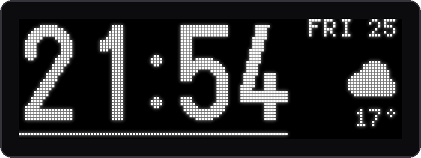
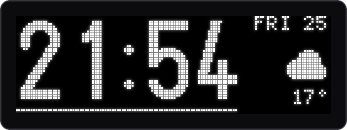
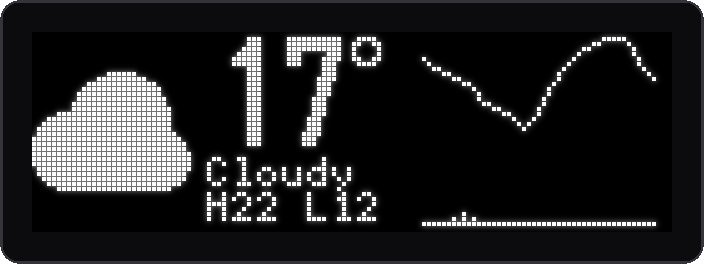
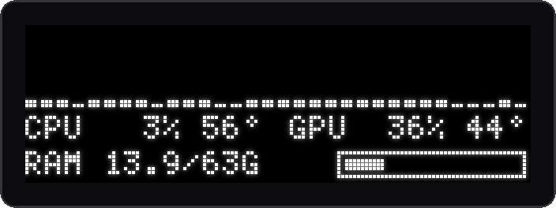

# apex-oled

[](https://github.com/kevincardwell/apex-oled/actions/workflows/ci.yml)
[](https://github.com/kevincardwell/apex-oled/releases/latest)
[](LICENSE)


A clock, the weather, live system stats and an audio spectrum on the **SteelSeries Apex 7**'s
little OLED screen — on Linux, where SteelSeries GG doesn't exist. One small Rust daemon, about
3 MB of RAM, and a CPU cost you'd need a stopwatch to find.

<p align="center">
  
</p>

<p align="center"><sub>Rendered from the real pages with <code>apex-oled --preview</code> — every pixel here is a pixel on the keyboard.</sub></p>

---

## Features

- 🕐 **Clock** — big digits, day and date, the current weather in the corner, and a line that fills across each minute.
- 🌦️ **Weather** — conditions, today's high and low, and the next 24 hours as a temperature line over chance-of-rain bars. From [Open-Meteo](https://open-meteo.com): no account, no API key.
- 📊 **System** — one bar per CPU thread (a 16-core/32-thread CPU fills the 128 px width exactly), CPU and GPU load and temperature, RAM used.
- 🎵 **Spectrum** — 64 bars mirrored around the middle, bass in the centre, 30 fps from [cava](https://github.com/karlstav/cava). It keeps playing while you're away from the desk, and goes dark a few seconds after the music stops.
- 💤 **Blanks when you're idle** — the compositor says when there's been no input (ext-idle-notify), so it goes dark with your screensaver and wakes on the next keypress. A playing video doesn't keep it lit.
- 🔥 **Burn-in care** — the whole image orbits one pixel a minute, layouts are mostly black, and the screen is blanked on idle and on exit.
- 🔌 **Plug and play** — udev starts the service when the keyboard appears and stops it when it goes. No reconnect logic, nothing to babysit.
- 🪶 **Cheap** — it only redraws what changed, only samples what's on screen, and never spawns a process per tick. See [the numbers](#what-it-costs).

## The pages

<table>
  <tr>
    <td></td>
    <td></td>
  </tr>
  <tr>
    <td></td>
    <td></td>
  </tr>
</table>

Press your keybinding to step through them: clock → weather → system → spectrum → clock.

---

## Requirements

- **A SteelSeries Apex 7** (USB ID `1038:1612`). The Apex 7 TKL, Apex Pro, Apex Pro TKL and Apex 5
  use the same screen protocol and are enabled too, but untested — see [Other keyboards](#other-keyboards).
- **Linux with systemd** — the daemon is a user service and udev grants the access.
- **x86_64 with glibc 2.34+** for the release binary, or **Rust 1.88+** to build it yourself ([rustup.rs](https://rustup.rs)).
- Optional, each only for its own feature:
  - `curl` — weather
  - `cava` — the spectrum page
  - the NVIDIA driver — GPU load and temperature
  - a Wayland compositor with `ext-idle-notify-v1` (tested on Hyprland) — idle blanking. Without it the screen simply never blanks.

## Install

**Prebuilt** — download `apex-oled-<version>-x86_64-linux.tar.gz` from the
[latest release](https://github.com/kevincardwell/apex-oled/releases/latest), then:

```bash
tar xzf apex-oled-*-x86_64-linux.tar.gz
cd apex-oled-*-x86_64-linux
./install.sh
```

**From source:**

```bash
git clone https://github.com/kevincardwell/apex-oled
cd apex-oled
./install.sh
```

The script (building first, if it's a source checkout) installs three files:

| File | What it is |
|---|---|
| `~/.local/bin/apex-oled` | the daemon |
| `~/.config/systemd/user/apex-oled.service` | its user service |
| `/etc/udev/rules.d/71-apex-oled.rules` | screen access + auto-start (the only `sudo` step) |

The keyboard's screen lives on its own USB interface, and the rule gives your login session
access to **that interface only** — interface 0, which carries your keystrokes, stays
root-only. Run `./install.sh` again to update, or `./install.sh --uninstall` to remove everything.

## Switching pages

The daemon moves to the next page on `SIGUSR1`. Bind this to a key:

```bash
systemctl --user kill --kill-whom=main -s USR1 apex-oled
```

<details>
<summary>Omarchy, Hyprland and Sway examples</summary>

**Omarchy** — `~/.config/hypr/bindings.lua`:

```lua
o.bind("SUPER + ALT + O", "Keyboard OLED: next page", "systemctl --user kill --kill-whom=main -s USR1 apex-oled")
```

**Hyprland** — `hyprland.conf`:

```ini
bind = SUPER ALT, O, exec, systemctl --user kill --kill-whom=main -s USR1 apex-oled
```

**Sway**:

```ini
bindsym $mod+Mod1+o exec systemctl --user kill --kill-whom=main -s USR1 apex-oled
```

</details>

> [!NOTE]
> Keep `--kill-whom=main`. Without it, systemd signals every process in the service —
> including cava, which treats `SIGUSR1` as "reload your config".

## Configuration

On **Omarchy** there is nothing to configure: the weather location comes from the bar's weather
widget, and the idle delay matches your screensaver.

Anywhere else, set environment variables on the service with `systemctl --user edit apex-oled`:

```ini
[Service]
Environment=APEX_OLED_LOCATION=40.71,-74.01
Environment=APEX_OLED_UNITS=fahrenheit
Environment=APEX_OLED_IDLE=300
```

| Variable | Meaning | Default |
|---|---|---|
| `APEX_OLED_LOCATION` | `latitude,longitude` for the weather | Omarchy's weather location, otherwise no weather |
| `APEX_OLED_UNITS` | `fahrenheit` for °F | °C |
| `APEX_OLED_IDLE` | seconds without input before the screen blanks; `0` never blanks | Omarchy's screensaver delay, otherwise 300 |

Then `systemctl --user restart apex-oled`.

## Everyday commands

```bash
systemctl --user status apex-oled     # running?
systemctl --user restart apex-oled    # restart (starts on the clock)
systemctl --user stop apex-oled       # blank the screen until the next replug or login
journalctl --user -u apex-oled        # errors, if anything looks wrong
```

---

## What it costs

Measured on a Ryzen 9 5950X with an RTX 4070 Ti:

| On screen | CPU | Memory (RSS) | Notes |
|---|---|---|---|
| Clock or weather | under 10 ms per 30 s | 3 MB | one USB write a second, at most |
| System | 10 ms per 30 s | 28 MB | 24 MB of that is NVIDIA's library, loaded the first time you open the page |
| Spectrum, music playing | 0.23 % of one core | 28 MB | plus cava: 0.78 % of one core, 5 MB PSS |
| Blanked (idle) | no timer at all | — | the weather thread checks the clock once a minute |

- A frame is 642 bytes and takes **4 ms** to reach the keyboard, so the spectrum's 30 fps uses
  about an eighth of what the screen can take.
- GPU stats go through NVIDIA's library in-process: **25 µs** a read, against **21 ms** for
  spawning `nvidia-smi`.
- The release binary is about 700 KB.

## How it works

```
  signals    weather    idle (Wayland)    cava
     │          │             │             │
     └──────────┴──────┬──────┴─────────────┘
                       ▼
                  one channel
                       │
                       ▼
     main loop: wakes on the next second or the next event
                       │
                       ▼
     draw the visible page into 128×40 bits, shift by the 1 px orbit
                       │
                       ▼
     same as the last frame? ── yes ──► nothing sent
                       │ no
                       ▼
     HIDIOCSFEATURE: 642 bytes to the keyboard, 4 ms
```

**The screen protocol.** The OLED is 128×40, one bit per pixel. It sits on USB interface 1,
whose HID descriptor has a single 642-byte feature report: a `0x61` command byte, 640 bytes of
pixels (row by row, leftmost pixel in the high bit), and a `0x00` pad. Writing that report
with the `HIDIOCSFEATURE` ioctl puts the image on screen. That's the whole protocol — credit to
[apex-tux](https://github.com/not-jan/apex-tux), which worked it out.

**One thread draws.** Helper threads — a `sigwait` loop, the weather fetcher, the Wayland idle
watcher and the cava reader — only post events to a channel. The main loop sleeps until the next
second boundary or the next event, redraws the visible page, and writes it only if a single pixel
changed. Pages that aren't showing cost nothing: stats are sampled only on the system page, and
cava runs only while the spectrum is up.

**Idle comes from the compositor.** The daemon asks for an `ext-idle-notify-v1` input-idle
notification, which ignores idle inhibitors: a video keeping your monitor awake is no reason to
keep the keyboard lit. It finds the Wayland socket itself and reconnects every 5 s, so it copes
with starting before the compositor at login, and with the compositor restarting.

**Weather** is one request to Open-Meteo every 30 minutes through `curl`, so there's no TLS stack
in the binary. It checks the wall clock once a minute, so waking from suspend refreshes it
promptly.

**The spectrum** is cava in raw 8-bit mode, stereo (bass in the centre), with `sleep_timer` set so
it stops producing anything during silence.

## Previews and development

```bash
apex-oled --preview weather > weather.pbm          # one frame, no keyboard needed
apex-oled --preview spectrum 90 > spectrum.pbm     # 90 frames at 30 fps, as one multi-image PBM
magick weather.pbm -scale 600% weather.png         # view it

cargo test                                         # frame packing, CPU maths, weather parsing
tools/oled-test.py                                 # hardware check: timed writes + a test card
tools/render-docs.sh                               # regenerate every image in this README
```

## Other keyboards

The udev rule also matches these, which use the same frame format according to apex-tux. They
have **not** been tested with apex-oled:

| Keyboard | USB ID |
|---|---|
| Apex 7 | `1038:1612` ✅ tested |
| Apex 7 TKL | `1038:1618` |
| Apex Pro | `1038:1610` |
| Apex Pro TKL | `1038:1614` |
| Apex 5 | `1038:161c` |

If you have one, install and run `tools/oled-test.py`: it reports how long a write takes and
leaves a test card (a border, a solid square top-left, a diagonal and a checkerboard) on the
screen. An issue saying whether it worked is very welcome. Third-generation keyboards (Apex Pro
Gen 3 and later) use a different, chunked protocol and aren't supported.

## Not included, and why

- **RGB lighting, macros, actuation settings.** Those are different parts of the keyboard; this
  project only drives the screen. For lighting, [OpenRGB](https://openrgb.org) supports the Apex 7
  — though apex-tux users report the two can clash, so try it before relying on both.
- **A settings app.** Four pages, one keybinding and three environment variables don't need one.
- **Snow, fog and storm icons.** The bitmap icon font has none, so those borrow the nearest icon
  and the label names the weather.

## Troubleshooting

- **`Permission denied` or `No such file` for `/dev/apex-oled`** — the udev rule hasn't applied
  to the keyboard yet. Unplug it and plug it back in, then check `ls -l /dev/apex-oled`.
- **"waiting for weather" never goes away** — no location. Set `APEX_OLED_LOCATION`, and check that
  `/usr/bin/curl` exists.
- **The spectrum stays flat** — nothing is playing, or cava can't capture. Run
  `cava` by hand to see its error, and check `journalctl --user -u apex-oled`.
- **The screen never blanks** — your compositor may not implement `ext-idle-notify-v1`; the
  journal says so once at startup.

## Acknowledgments

- [apex-tux](https://github.com/not-jan/apex-tux) by not-jan — the Apex OLED protocol and the list of compatible keyboards.
- [U8g2](https://github.com/olikraus/u8g2) fonts via the [u8g2-fonts](https://github.com/Finomnis/u8g2-fonts) crate, drawn with [embedded-graphics](https://github.com/embedded-graphics/embedded-graphics). The fonts carry their own licences — see the [U8g2 licence](https://github.com/olikraus/u8g2/blob/master/LICENSE).
- [cava](https://github.com/karlstav/cava) for the audio analysis.
- Weather data by [Open-Meteo.com](https://open-meteo.com) ([CC BY 4.0](https://creativecommons.org/licenses/by/4.0/)).
- Built on and for [Omarchy](https://omarchy.org).

## Disclaimer

Not affiliated with or endorsed by SteelSeries. apex-oled only writes the screen's image report,
the same one other open-source tools use, but it's still unofficial: use it at your own risk.

## License

[MIT](LICENSE)
